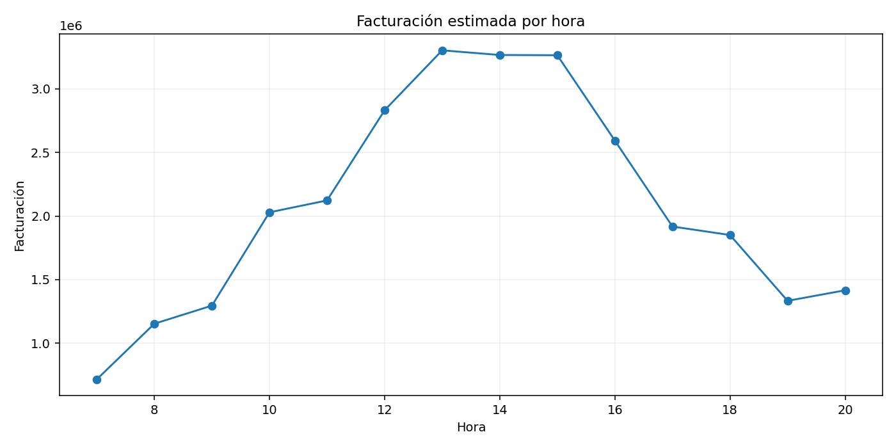
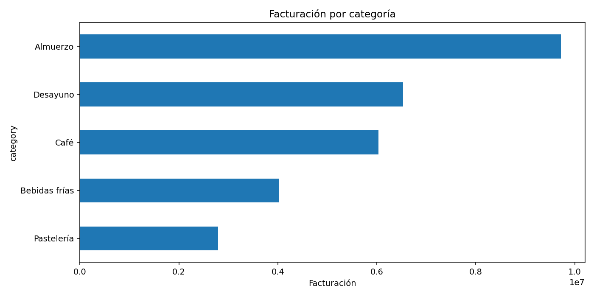
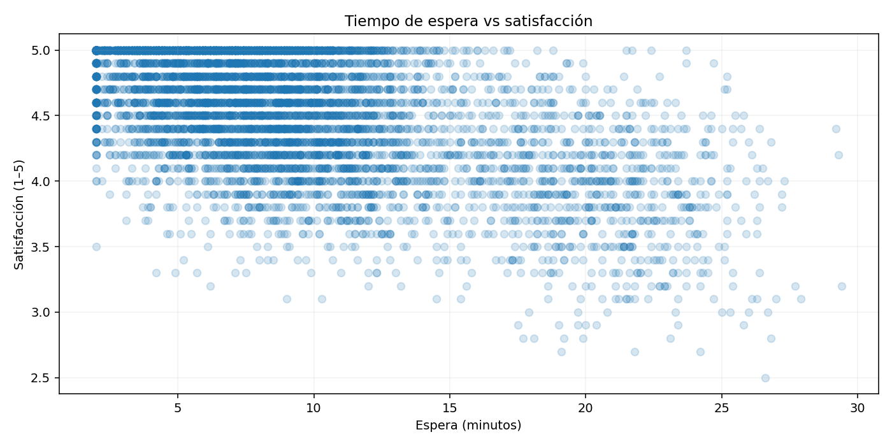
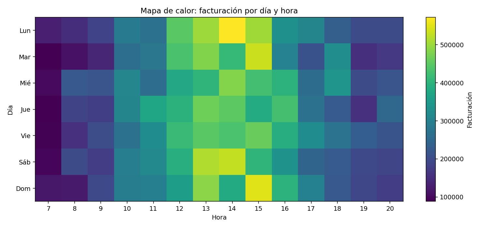

# Café al Minuto — Analítica de un negocio cotidiano

<p align="center"><strong>Un caso de Data Analytics sobre lo que realmente pasa detrás de un café de barrio.</strong><br>Python · SQL · Power BI · Visualización · Business Analytics</p>

---

## ¿De qué trata?

**Café al Minuto** es un caso de estudio ficticio creado para responder una pregunta simple:

> **¿Qué pasa cuando una cafetería deja de mirar solamente cuánto vende y empieza a entender cómo, cuándo y por qué compra la gente?**

El proyecto intenta contar una historia más humana: personas que pasan por un café antes de trabajar, clientes que repiten su pedido, horas en las que se forma una fila y momentos en los que unos minutos de espera pueden cambiar la experiencia.

>  **Datos 100% sintéticos**, generados exclusivamente para portfolio. No representan una cafetería real.

##  Problema de negocio

La cafetería necesita tomar mejores decisiones sobre:

- ¿Cuáles son realmente sus horas pico?
- ¿Qué productos generan más facturación?
- ¿El tiempo de espera afecta la satisfacción?
- ¿Qué diferencia existe entre clientes nuevos, habituales y frecuentes?
- ¿Qué canales funcionan mejor?
- ¿En qué momentos conviene reforzar la operación?
- ¿Vender más siempre significa tener una mejor operación?

La idea es pasar de **“hoy vendimos X”** a **“sabemos qué ocurrió, cuándo ocurrió y qué podríamos hacer al respecto”**.

## Dataset

El proyecto contiene **6.500 pedidos sintéticos** correspondientes a 2025.

| Campo | Descripción |
|---|---|
| `order_id` | Identificador del pedido |
| `date` | Fecha |
| `weekday` | Día de la semana |
| `hour` | Hora |
| `channel` | Mostrador, Takeaway o Delivery |
| `customer_type` | Nuevo, Habitual o Frecuente |
| `category` | Categoría del producto |
| `product` | Producto |
| `quantity` | Cantidad |
| `unit_price` | Precio unitario |
| `discount_pct` | Descuento |
| `ticket_amount` | Importe final |
| `wait_minutes` | Tiempo estimado de espera |
| `satisfaction` | Satisfacción de 1 a 5 |
| `returned_within_30d` | Retorno dentro de 30 días |

## Preguntas analíticas

### 01 — El ritmo del negocio
¿Cuáles son las horas y días de mayor actividad?

### 02 — El producto
¿Qué categorías y productos explican una mayor parte de la facturación?

### 03 — La experiencia
¿Existe una relación entre tiempo de espera y satisfacción?

### 04 — Los clientes
¿Cómo se comportan los clientes nuevos, habituales y frecuentes?

### 05 — La operación
¿En qué momentos sería razonable reforzar recursos para evitar cuellos de botella?

## Gráficos

### Facturación por hora


### Facturación por categoría


### Tiempo de espera vs satisfacción


### Mapa de calor


## Una mirada más humana

Este proyecto no busca demostrar que **X causa Y**. Busca identificar señales que merecen atención.

Por ejemplo, si determinados horarios combinan mayor volumen y mayores tiempos de espera, aparece una pregunta de negocio:

> **¿Estamos maximizando ventas a costa de empeorar la experiencia?**

Ese es el punto donde los datos dejan de ser solamente números y empiezan a ayudar a tomar decisiones.

## Python

El análisis contempla:

- Pandas
- NumPy
- Matplotlib
- Estadística descriptiva
- Feature engineering
- Segmentación
- Análisis temporal
- Correlaciones
- Visualización

Notebook: `notebooks/01_cafe_al_minuto_analysis.ipynb`

## SQL

`sql/analysis.sql` incluye consultas para:

- facturación diaria y mensual
- ticket promedio
- ventas por hora
- ventas por categoría
- comportamiento por canal
- clientes recurrentes
- espera vs satisfacción
- ranking de productos
- horarios de alta demanda

## Dashboard

Se propone un Dashboard de 4 páginas:

**☕ Resumen:** facturación, pedidos, ticket, satisfacción, espera y retorno.

**🕐 Ritmo:** heatmap día/hora, facturación y pedidos por hora.

**🥐 Productos:** ranking, categorías, unidades y ticket promedio.

**❤️ Experiencia:** espera vs satisfacción, satisfacción por canal y tipo de cliente, retorno a 30 días.

## 💡 De datos a decisiones

| Señal | Pregunta | Acción potencial | Métrica |
|---|---|---|---|
| Alto volumen + alta espera | ¿Hay un cuello de botella? | Reforzar operación | Espera promedio |
| Menor satisfacción con esperas largas | ¿Se deteriora la experiencia? | Revisar preparación/despacho | Satisfacción |
| Alta recurrencia | ¿Qué hace que vuelvan? | Fidelización | Tasa de retorno |
| Ventas concentradas | ¿Existe dependencia? | Optimizar mix | Participación |

## Nota metodológica

Al ser datos sintéticos, los resultados sirven para demostrar el proceso analítico y generar hipótesis. No deben presentarse como evidencia sobre cafeterías reales.

## Arquitectura

```text
cafe-al-minuto/
├── data/
│   ├── raw/orders.csv
│   └── processed/daily_summary.csv
├── dashboard/dashboard_spec.md
├── docs/
├── images/
├── notebooks/01_cafe_al_minuto_analysis.ipynb
├── sql/analysis.sql
├── src/generate_data.py
├── .gitignore
├── LICENSE
├── README.md
└── requirements.txt
```

## Tecnologías

| Herramienta | Uso |
|---|---|
| Python | Análisis y transformación |
| Pandas / NumPy | Datos y cálculos |
| Matplotlib | Visualización |
| SQL | Consultas y KPI |
| Power BI | Dashboard |
| Git / GitHub | Portfolio y versionado |

## Reproducibilidad

```bash
pip install -r requirements.txt
python src/generate_data.py
```

